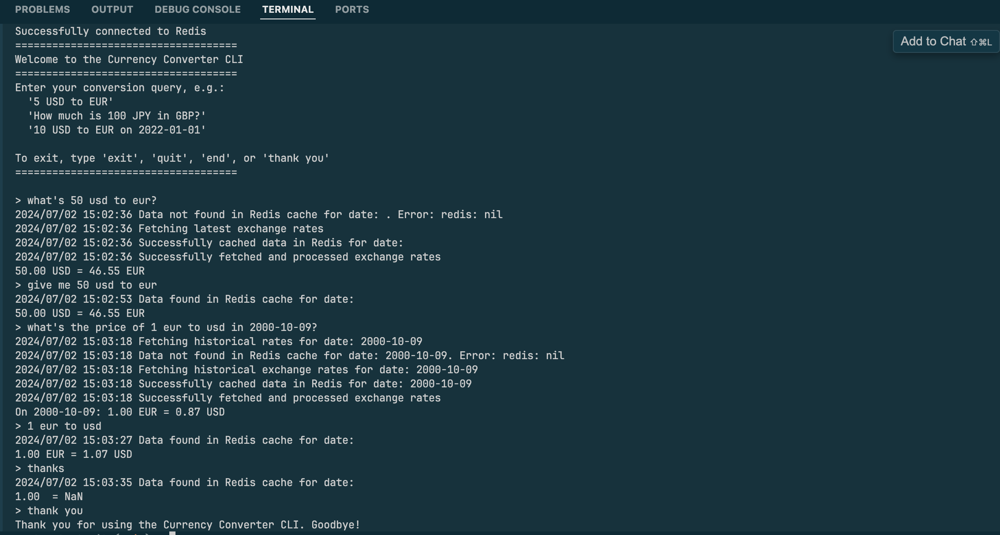
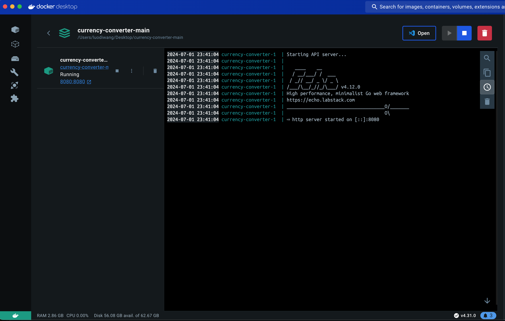
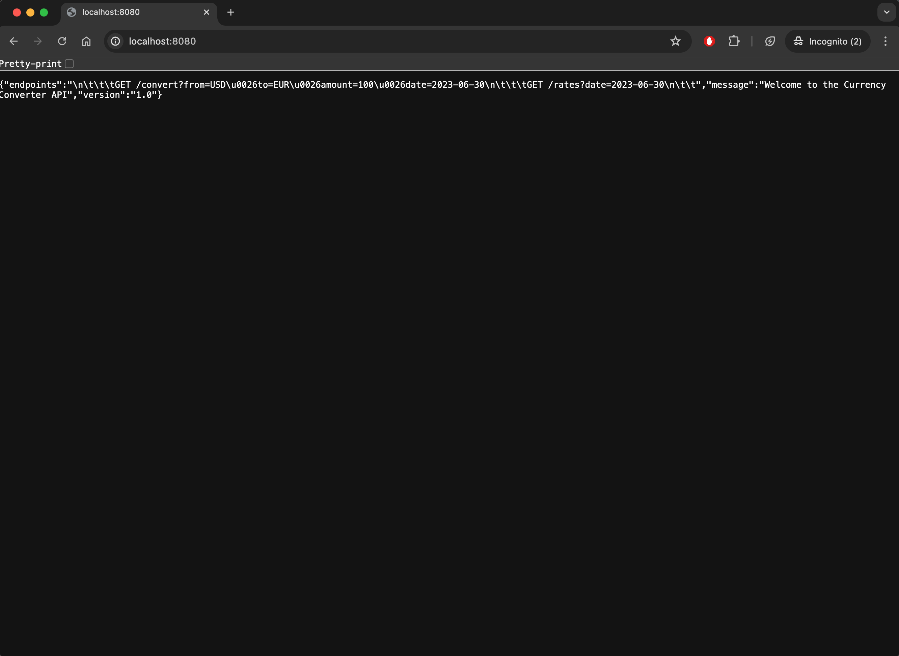
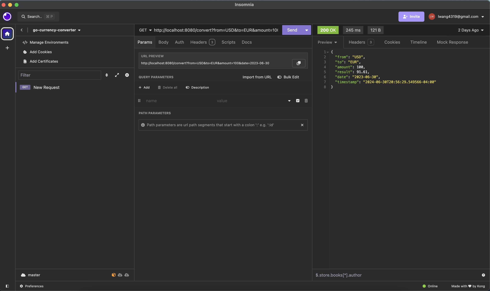

<div align="center">
# Currency Converter
<pre>
Currency Converter CLI program written in Go with natural-language interpretation.

## What is Currency Converter?
Currency Converter is a terminal application that uses Go, Redis, Echo, and is deployed on Docker for converting currencies with exchange rates from [Open Exchange Rates API](https://openexchangerates.org/) and it also has historical currency rates from any date all the way back to [1st January 1999](https://docs.openexchangerates.org/reference/historical-json).



What's special about this is that it uses basic NLP implemented through Go packages, using ```strings``` and ```regexp``` to use extract any typed in command from the terminal and do conversions for the user.

## Demo and Application 
Video:


Converting Currencies and Accessing Historical Data:


Docker:


Currency Converter API Call:


API testing in Insomnia:


## Caching and making an API with Echo 
This project uses a two-level caching system and a cache key. The first level is file based caching where the conversion data is stored on in the ```cache.json``` file. If a conversion isn't in there, it uses Redis which is set to a 24 hr expiry time. The cache key is to see the date at which a request is made- and based on that, it caches the currency conversion rates and historical exchange rates individually. 

It'd be useful for this application to have an API endpoint, made with the open-sourced Echo framework. 

</pre>

</div>

## Running the Application on your LocalHost
1. create a .env file with - `FILE_NAME` (cache filename), `CACHE_EXPIRY_IN_SECONDS` (expiry time)`PRECISION` (currency conversion digits)

2. assign `APP_ID` to your app id for the Open Exchange Rate API Key.
```
# .env

APP_ID=<APP_ID>
```
3. `go run .`
4. ```go build```
5. ````./currencyconverter```
